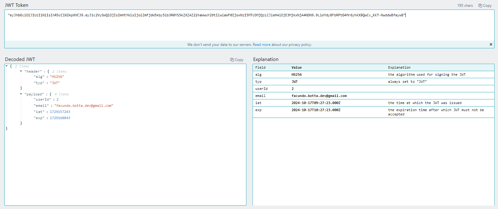
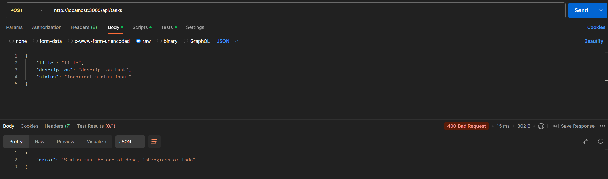
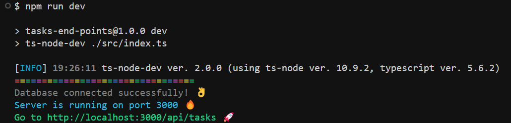

# Task Management API 🚀

This API allows you to manage tasks in applications, including creating, reading, updating, and deleting tasks. It uses Express and MySQL as the database 😎

## Its secure with JWT 🔐

To alow users to access the API you need to register a user in the api database and log in to generate a token.

### Register a new user in the API database

- **Method:** `POST`
- **Route:** `/api/register`
- **Request Body:**
  ```json
  {
    "email": "user@example.com",
    "password": "password"
  }
  ```
- **Response:**
  ```json
  {
    "status": "ok",
    "message": "User added successfully"
  }
  ```

### Log in a user

- **Method:** `POST`
- **Route:** `/api/login`
- **Request Body:**
  ```json
  {
    "email": "user@example.com",
    "password": "password"
  }
  ```
- **Response:**
  ```json
  {
    "token": the new token generated,
  }
  ```
- _Now you need to add this token in the header of the request to access the API_
- **The token:**
  

## It's type safe 💪

If you trate to introduce a incorrect type in the request body you will get something like this:


## Tasks Endpoints

### 1. Get All Tasks (of the logged in user)

- **Method:** `GET`
- **Route:** `/api/tasks`
- **Headers:**
  - Authorization: Bearer &lt;_your token here_&gt;
- **Query Parameters:**
  - `page`: Page number (Optional, defaults to 1)
  - `limit`: Number of results per page (Optional, defaults to 10, or returns all if omitted)
- **Examples:**
  - `http://localhost:3000/api/tasks?page=2&limit=20`
  - `http://localhost:3000/api/tasks?limit=5`
  - `http://localhost:3000/api/tasks`
- **Response:**
  ```json
  {
    "tasks": [ ... ],  // Array of tasks
    "total": 100,      // Total number of tasks
    "page": 2,         // Current page
    "limit": 20        // Limit of tasks per page
  }
  ```

### 2. Get Task by ID

- **Method:** `GET`
- **Route:** `/api/tasks/:id`
- **URL Params:**
  - `id`: Task ID
- **Headers:**
  - Authorization: Bearer &lt;_your token here_&gt;
- **Response:**
  ```json
  {
    "task": { ... },  // Task object
  }
  ```

### 3. Add Task

- **Method:** `POST`
- **Route:** `/api/tasks`
- **Headers:**
  - Authorization: Bearer &lt;_your token here_&gt;
- **Request Body:**
  ```json
  {
    "title": "Task Title",
    "description": "Task Description",
    "status": "todo", // Possible values: done, inProgress, todo
    "userId": 1, // User ID will be taken from the token passed in the header
    "parentTaskId": null, // Parent task ID
    "deadline": null, // Date object
    "priority": 1 // Priority of the task
  }
  ```
- **Response:**
  ```json
  {
    "id": 1,
    "title": "Task title",
    "description": "Task description",
    "status": "todo",
    "userId": 1,
    "parentTaskId": null,
    "deadline": "2024-12-31T23:59:59",
    "createdAt": "2024-01-01T12:00:00",
    "updatedAt": "2024-01-01T12:00:00"
  }
  ```

### 4. Update Task

- **Method:** `PUT`
- **Route:** `/api/tasks/:id`
- **URL Params:**
  - `id`: Task ID
- **Headers:**
  - Authorization: Bearer &lt;_your token here_&gt;
- **Request Body:**
  ```json
  {
    "title": "New Task Title",
    "description": "New Task Description",
    "status": "todo",
    "userId": 1, // User ID will be taken from the token passed in the header
    "parentTaskId": null,
    "deadline": null,
    "priority": 1
  }
  ```
- **Response:**
  ```json
  {
    "id": 1,
    "title": "New title",
    "description": "New description",
    "status": "inProgress",
    "userId": 1,
    "parentTaskId": null,
    "deadline": "2024-12-31T23:59:59",
    "createdAt": "2024-01-01T12:00:00",
    "updatedAt": "2024-01-02T12:00:00"
  }
  ```

### 5. Delete Task

- **Method:** `DELETE`
- **Route:** `/api/tasks/:id`
- **URL Params:**
  - `id`: Task ID
- **Headers:**
  - Authorization: Bearer &lt;_your token here_&gt;
- **Response:**
  ```json
  {
    "message": "Task deleted successfully"
  }
  ```

# Requirements

- Node.js
- MySQL (I'm using docker to run the database at the moment)
  > Check ./src/db/ApiSchema.sql file to get the db schema needed.

# Installation

1. Clone the repository
   ```bash
    git clone https://github.com/FacuBotta/Task-Management-API.git
    cd Task-Management-API
   ```
2. Install dependencies
   ```bash
    npm install
   ```
3. Create a `.env` file in the root directory and add the following variables:
   ```bash
    JWT_SECRET=your_secret_key
    JWT_EXPIRATION_TIME=3h
    SERVER_PORT=3000
    DB_HOST=localhost
    DB_PORT=3306
    DB_USER=your_database_user
    DB_PASSWORD=your_password
    DB_NAME=your_database_name
   ```
4. Start the server
   ```bash
    npm run tsc // Compile the TypeScript files
    npm run start // Start the server
    or
    npm run dev // Start the server in development mode
   ```
5. You wil get a message like this:
   

6. ## Let me a ⭐️ if you liked it 😊
